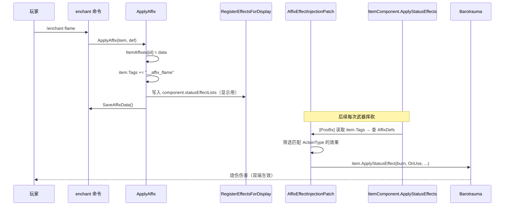

# affix-effects design

## 0. 术语约定

| 术语 | 定义 | 防冲突结论 |
|------|------|-----------|
| `StatusEffect` | Barotrauma 核心类，定义了一个可执行的游戏效果（伤血/加成/生成物等），由 `ActionType` 决定触发时机 | 复用 Barotrauma 原生类，无命名冲突 |
| `statusEffectLists` | `Item` 上的 `private readonly Dictionary<ActionType, List<StatusEffect>>`，存储物品所有组件的永久效果列表 | 对 mod 不可见，需反射访问 |
| `hasStatusEffectsOfType` | `Item` 上的 `private readonly bool[]`，按 `ActionType` 标记是否存在效果，用于快速跳过 | 对 mod 不可见，需反射同步更新 |
| `ActionType` | Barotrauma 枚举（`OnActive` / `OnUse` / `OnImpact` / `OnWearing` 等），决定效果何时触发 | 复用原生，不新增类型 |
| `AffixEffectTracker` | 新增字典 `Dictionary<ushort, List<StatusEffect>>`，记录每个物品被词缀注入了哪些效果实例 | 纯 mod 内部概念 |

## 1. 决策与约束

### 需求摘要

- **做什么**：使 `Affixes.xml` 中定义的 `<StatusEffect>` 子元素在词缀应用时真正生效——添加到物品的 `statusEffectLists` 中，由 Barotrauma 原生系统按 `ActionType` 自动触发
- **为谁**：潜渊症玩家，使用 `enchant` 命令或加载已有词缀存档时，词缀产生可见的游戏内效果（增伤/减伤/加速等）
- **成功标准**：
  1. `enchant` 后物品持有者能感受到效果（如伤害变化、速度变化）
  2. 存档加载后效果正确恢复
  3. 移除词缀后效果消失
  4. 效果与物品原有效果正确叠加（累加而非覆盖）
- **明确不做什么**：
  - 不新增 `ActionType`（全部使用 Barotrauma 现有枚举）
  - 不修改 Barotrauma 核心程序集（仅通过 Harmony 补丁 + 反射）
  - 不涉及网络同步改动（Barotrauma 原生 `ApplyStatusEffect` 已处理网络复制）
  - 不在此 feature 中为 28 个词缀全部填满 `<StatusEffect>` 内容——仅添加 2-3 个示例证明管线可行，其余留给后续按设计填充
  - 不修改附魔台 UI/交互逻辑

### 复杂度档位

走 **"项目内部工具"默认档位**，无偏离：
- 健壮性 L2（够用）：错误日志 + 跳过损坏效果，不崩游戏
- 结构 functions：效果注入逻辑放在 Mod.cs 新方法中
- 性能 reasonable：反射缓存 FieldInfo，不在每帧做
- 可读性 team：关键路径有注释
- 可测试性 untested：暂无自动化测试，手动 `/enchant` + `/listaffixes` 验证
- 可观测性 logged：注入/移除效果时输出日志
- 幂等性 idempotent：ApplyAffix 检查已有词缀去重

### 关键决策

**D1：通过反射访问 `Item.statusEffectLists`** ⚠️ 已被 D5 取代

- **原始选择**：`typeof(Item).GetField("statusEffectLists", ...)` 获取 FieldInfo
- **取代原因**：issue `2026-06-17-affix-effect-client-only` 发现 `enchant` 命令仅客户端执行，服务端 `statusEffectLists` 从未被修改，词缀效果完全不生效
- **替代方案见 D5**

**D3：效果跟踪与移除** ⚠️ 已被 D5 取代

- **原始选择**：`AffixEffectTracker` 字典追踪注入效果，RemoveAffix 时清理
- **取代原因**：D5 方案不再需要持久化效果追踪——效果由 Harmony 补丁动态触发，移除词缀只需清理标签 + 显示数据

**D4：`ContentXElement` 构造方式**（保留）

- **选择**：`new ContentXElement(null, xelement)`
- **理由**：`StatusEffect.Load` 接受 `ContentXElement`，null package 对纯效果无影响
- **注意**：`ContentXElement` 构造函数签名 `ContentXElement(ContentPackage package, XElement element)`

**D5：Harmony Postfix 动态注入替代反射字典修改** 🔄 实施后追加

- **选择**：`AffixEffectInjectionPatch` — Harmony Postfix 打在 `ItemComponent.ApplyStatusEffects` 上，每次触发时从 `item.Tags`（共享 Item 属性）读取词缀 ID → 查 `AffixDefs`（两端独立加载，数据一致）→ 筛选匹配今次 ActionType 的效果 → 调用 `item.ApplyStatusEffect()` 逐条应用
- **被拒方案（原 D1）**：反射修改 `Item.statusEffectLists` — 仅客户端生效，服务端处理武器攻击时无效果
- **理由**：Harmony 补丁在客户端+服务端均运行，天然解决单侧注入问题。标签作为跨端共享信号，`AffixDefs` 两端独立加载但数据一致
- **优点**：无需反射、无 readonly 字段问题、移除词缀只需清理标签 + 显示数据
- **局限**：enchant 后需过 round 等待服务端 `RestoreAffixes` 确认（客户端/服务端分离架构固有行为，非此方案独有）

## 2. 名词与编排

### 2.1 名词层

#### 现状

- **`AffixDef.Effects`**（`Mod.cs:459`）：`List<StatusEffect>`，从 `<Affix>` 的 `<StatusEffect>` 子元素加载（`Mod.cs:127-143`）
- **`AffixData.Effects`**（`Mod.cs:449`）：`List<StatusEffect>`，存储对 `AffixDef.Effects` 的引用
- **`Helpers.TryReadAffixFromTags`**（`HarmonyPatches.cs:18-30`）：现有工具方法，从共享 `item.Tags` 中读取 `__affix_*` 标签 → 查找 `AffixDefs`
- **`ItemComponent.statusEffectLists`**（Barotrauma）：`public readonly Dictionary<ActionType, List<StatusEffect>>`，武器/装备组件在被使用时遍历此字典触发效果
- **`ItemComponent.ApplyStatusEffects`**（Barotrauma）：组件触发效果的标准入口，被所有武器/装备子类调用

#### 变化

- **`AffixEffectInjectionPatch`**（`HarmonyPatches.cs:166-189`，新增）：
  - Harmony `[HarmonyPatch]` + `TargetMethod()` 打在 `ItemComponent.ApplyStatusEffects` 上
  - Postfix 使用 `object[] __args` 接收参数（避开 `ItemComponent` internal 类型限制）
  - 每次组件触发效果时：从 `item.Tags` 读词缀 ID → 查 `AffixDefs` → 筛选匹配 `ActionType` → 调 `item.ApplyStatusEffect()`
  - 客户端+服务端均运行，天然双端一致
- **`RegisterEffectsForDisplay` / `UnregisterEffectsFromDisplay`**（`Mod.cs`，新增）：
  - 轻量级方法，将效果写入/移除 `ItemComponent.statusEffectLists`（公有字段，无需反射）
  - 仅用于外部模组（如"显示物品属性"）通过 `component.statusEffectLists` 读取效果信息
  - 不影响实际效果触发（触发走 Harmony 补丁）
- **`Affixes.xml` <StatusEffect> 示例**（`Items/Affixes.xml`）：为 `flame`、`shock`、`fortified` 三个词缀添加 `<StatusEffect>` 子元素

#### 接口示例

```csharp
// 来源：HarmonyPatches.cs AffixEffectInjectionPatch
// TargetMethod 通过反射查找 ItemComponent.ApplyStatusEffects
static MethodBase TargetMethod()
{
    var type = typeof(Item).Assembly.GetType("Barotrauma.Items.Components.ItemComponent");
    // 遍历方法找 ApplyStatusEffects(ActionType, float, ...)
    // 返回匹配的 MethodBase 供 Harmony 打补丁
}

// Postfix 使用 object[] 接收所有参数，避开 internal 类型限制
static void Postfix(object __instance, object[] __args)
{
    var type = (ActionType)__args[0];
    var item = Traverse.Create(__instance).Property("Item").GetValue<Item>();
    // 从 item.Tags 读词缀 → 查 AffixDefs → 注入匹配 ActionType 的效果
}
```

```csharp
// 来源：Mod.cs RegisterEffectsForDisplay
static void RegisterEffectsForDisplay(Item item, AffixDef affix)
{
    // 遍历 item.Components 的每个组件
    // 将 affix.Effects 追加到 component.statusEffectLists[effect.type]
    // 仅用于外部模组显示，不影响实际效果触发
}
```

### 2.2 编排层

#### 主流程图



#### 现状（修复后）

`ApplyAffix`（`Mod.cs:412-429`）：
1. 写入 `ItemAffixes` 字典
2. 追加 `__affix_*` 标签
3. 调用 `RegisterEffectsForDisplay` 写入组件显示数据

`AffixEffectInjectionPatch`（`HarmonyPatches.cs:166-189`）：
- Postfix 打在 `ItemComponent.ApplyStatusEffects` 上
- 客户端+服务端均运行
- 每次效果触发时动态注入匹配的词缀效果

`ItemLoadPatch.Postfix`（`HarmonyPatches.cs:149-163`）：
- 加载存档物品时调用 `ApplyAffix`，统一路径

`RemoveAffix` 命令（`Mod.cs:212-230`）：
- 调用 `UnregisterEffectsFromDisplay` 清理显示数据
- 移除 `ItemAffixes` 条目 + 清理标签

#### 流程级约束

- **幂等性**：标签追加前检查 `!item.Tags.Contains(affixTag)`
- **错误语义**：单个效果注入失败不影响其余效果（Harmony Postfix 中 `isNetworkEvent: false` 走原生错误处理）
- **时序**：enchant 后效果需过 round 才在服务端生效（客户端/服务端分离架构固有行为）
- **显示一致性**：`RegisterEffectsForDisplay` 仅在 ApplyAffix 时调用；加载存档时 ItemLoadPatch → ApplyAffix → 同样注册显示数据

### 2.3 挂载点清单

| 挂载点 | 位置 | 动作 |
|--------|------|------|
| `AffixEffectInjectionPatch` | `HarmonyPatches.cs:166` | **新增**：Harmony Postfix 打在 `ItemComponent.ApplyStatusEffects` 动态注入效果 |
| `RegisterEffectsForDisplay` | `Mod.cs` | **新增**：将效果写入 `ItemComponent.statusEffectLists`（仅显示用） |
| `UnregisterEffectsFromDisplay` | `Mod.cs` | **新增**：从 `ItemComponent.statusEffectLists` 移除效果（仅显示用） |
| `ApplyAffix` 调用点 | `Mod.cs:412` | **修改**：追加 `RegisterEffectsForDisplay` 调用 |
| `ItemLoadPatch.Postfix` 调用点 | `HarmonyPatches.cs:149` | **修改**：统一走 ApplyAffix 路径 |
| `RemoveAffix` 命令 | `Mod.cs:212` | **修改**：追加 `UnregisterEffectsFromDisplay` 调用 |

共 **6** 个挂载点。核心挂载点为 `AffixEffectInjectionPatch`（效果触发），其余为显示数据管理。

### 2.4 推进策略

1. **反射基础设施**：在 Helpers 中实现 GetStatusEffectLists / AddEffectToItem / RemoveEffectToItem，缓存 FieldInfo
   - 退出信号：编译通过 + 启动游戏无崩溃 + `Log` 确认能读取到 statusEffectLists 字典引用
2. **ApplyAffix 集成**：修改 ApplyAffix，添加效果注入 + 追踪逻辑，新增 ApplyAffixEffects / RemoveAffixEffects 方法
   - 退出信号：`/enchant` 后 `/listaffixes` 显示词缀，逐帧确认 `OnActive` 类型效果持续触发
3. **ItemLoadPatch 统一**：将 Postfix 改为调用 ApplyAffix
   - 退出信号：存档→重启→加载，效果依然生效
4. **RemoveAffix 清理**：修改 RemoveAffix 命令，移除效果
   - 退出信号：`/removeaffix` 后效果停止
5. **Affixes.xml 示例**：为 2-3 个词缀添加 `<StatusEffect>` 子元素，验证端到端
   - 退出信号：`/enchant` 指定词缀后，可观察游戏内效果数值变化

### 2.5 结构健康度与微重构

#### 评估

- **文件级 `Mod.cs`**（459 行）：当前行数适中，职责含生命周期/命令/持久化/AffixDef/AffixData。新增 `AffixEffectTracker` + `ApplyAffixEffects` / `RemoveAffixEffects` 方法（约 30-40 行），属于 `ApplyAffix` 的自然扩展，不引入新职责
- **文件级 `HarmonyPatches.cs`**（177 行）：当前职责清晰（显示补丁 + 存档补丁）。新增 3 个反射 helper 方法（约 40 行），是 `Helpers` 静态类的自然扩展
- **目录级 `CSharp/Shared/`**（现有 2 文件，本次不新增文件）：目录不拥挤，无需重组

#### 结论：不做

本次改动量小（两文件各加 ~40 行），均为现有功能的自然延伸，无需微重构。

## 3. 验收契约

### 关键场景清单

**正常路径：**

1. **附魔注入效果**：手持武器执行 `/enchant flame` → 词缀"火焰"前缀显示在物品名上 + 物品攻击时产生火焰类伤害效果
2. **效果叠加**：手持已有原生效的武器（如本来就有 `OnImpact` 爆炸效果的电击棍），附魔后两者效果同时触发 → 伤害日志/视觉效果同时出现
3. **效果恢复**：对物品附魔 → 存档 → 退出重进 → 加载存档 → 物品名仍有词缀前缀 + 效果仍生效
4. **移除效果清理**：附魔物品 → `/removeaffix` → 前缀消失 + 附加效果停止触发

**边界路径：**

5. **空效果词缀**：对只有 NamePrefix 无 `<StatusEffect>` 的旧版词缀（如 `brittle`）执行 `/enchant brittle` → 前缀正常显示，无效果注入，无报错
6. **替换词缀**：已附魔物品再次 `/enchant keen` → 旧词缀效果移除 + 新词缀效果生效，不叠加
7. **多物品独立**：分别附魔两个物品 → 两个效果独立互不干扰 → `/removeaffix` 一个不影响另一个

**错误路径：**

8. **损坏的 StatusEffect XML**：Affixes.xml 中某个 `<StatusEffect>` 缺少必要属性 → 警告日志输出，跳过该效果，其余正常效果仍注入
9. **对无组件物品附魔**（边缘情况，如某些 mod 物品没有 ItemComponent）→ 反射访问 statusEffectLists 时可能为 null，不应崩溃

### 明确不做的反向核对项

- 代码中不应出现对 Barotrauma 核心程序集的 IL 织入（仅 Harmony Prefix/Postfix + 反射 GetValue/SetValue）
- 不应出现新的 `ActionType` 枚举值定义
- `Affixes.xml` 示例添加不应超过 3 个词缀的 `<StatusEffect>` 子元素

## 4. 与项目级架构文档的关系

- **名词**：`AffixEffectTracker` 为 mod 内部实现细节，仅影响 mod 自身状态，不暴露给外部
- **动词骨架**：效果注入路径（`ApplyAffix` → `AddEffectToItem` → 反射写入 `statusEffectLists`）是 `ItemAffixes` 子系统内部流程，不影响 Barotrauma 其他模块
- **架构更新**：本 feature 改动局限在 `ItemAffixes` mod 内部，无系统级可见变化，验收后不触发 `ARCHITECTURE.md` 更新
