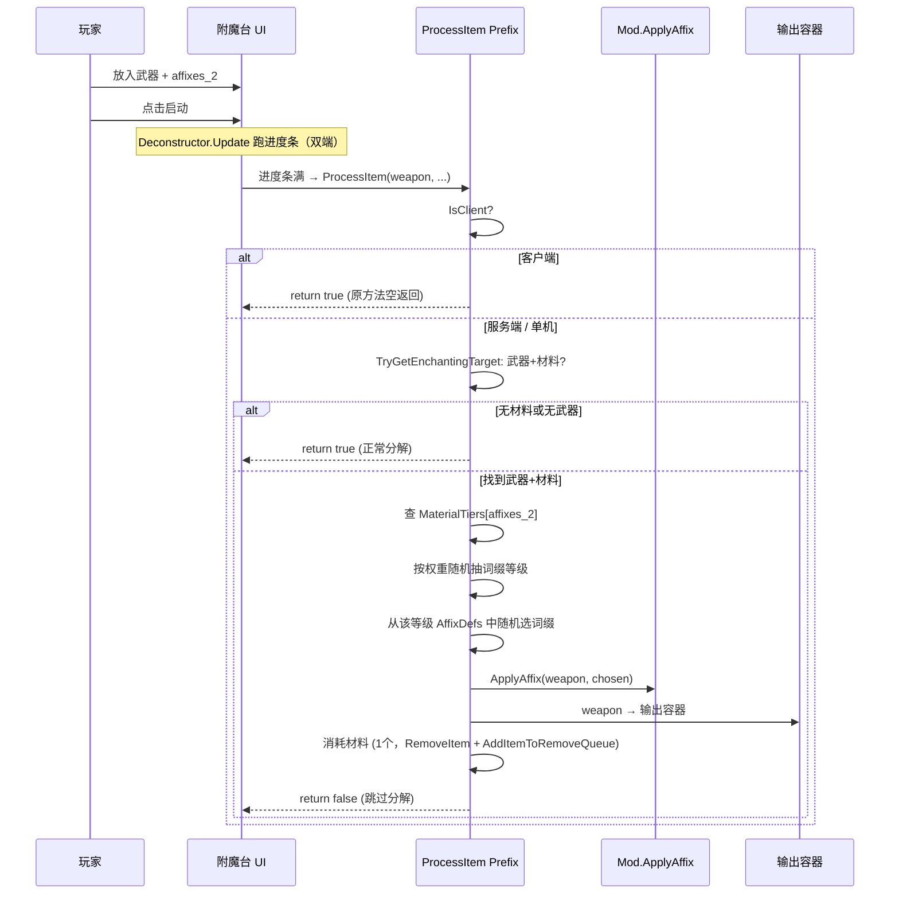

# enchanting-station-workflow design

## 0. 术语约定

| 术语 | 定义 |
|------|------|
| `Deconstructor` | Barotrauma 原生组件（`Barotrauma.Items.Components.Deconstructor`），将输入物品分解为材料并输出 |
| `ProcessItem` | Deconstructor 的 `private` 方法，在进度条满后调用，执行实际分解逻辑 |
| `EnchantingMaterial` | 新增附魔材料物品（`affixes_1`/`_2`/`_3`），放入附魔台作为词缀触媒 |
| 材料等级 | `affixes_1`=T1, `affixes_2`=T2, `affixes_3`=T3，决定词缀等级概率权重 |

## 1. 决策与约束

### 需求摘要

- **做什么**：附魔台放入武器+附魔材料 → 点击启动 → 进度条 → 完成时武器被附魔而非被分解，附魔武器输出到输出槽，材料消耗
- **为谁**：潜渊症玩家，替代 `/enchant` 命令行方式，通过游戏内物理交互完成附魔
- **成功标准**：
  1. 武器+材料放入输入槽 → 启动 → 进度条完成后武器获得词缀（前缀名+效果）
  2. 不放材料的纯武器仍然正常分解（Deconstructor 原生行为不变）
  3. 不同等级材料产出不同等级词缀（按权重随机）
  4. 支持未来扩展：指定 `affixid` 属性让材料固定产出某个词缀（如「火焰符文」必定出 flame）
- **明确不做什么**：
  - 不修改 Barotrauma 核心程序集（仅 Harmony Prefix）
  - 不改变 Deconstructor 的 UI/音效/粒子（复用原生反馈）
  - 不新增命令
  - 不在此 feature 中为材料添加纹理（已有占位 png）

### 复杂度档位

走"项目内部工具"默认，无偏离。

### 关键决策

**D1：Harmony Prefix 拦截 `Deconstructor.ProcessItem`**

- **选择**：Prefix 打在私有方法 `ProcessItem(Item, bool, Dictionary)` 上。检测输入容器中是否同时存在可附魔武器 + 附魔材料 → 是则执行附魔逻辑并 `return false`（跳过原生分解）→ 否则 `return true`（正常分解）
- **理由**：`ProcessItem` 是 Deconstructor 完成分解的唯一入口，Prefix 在此拦截可精确替换行为。使用 `TargetMethod()` 模式避开 internal 类型
- **备选方案**：Patch `Update()` 在进度条满前替换目标 — 时序复杂且需要重复进度条逻辑

**D2：材料等级→词缀权重配置化**

- **选择**：`Dictionary<string, TierWeights>` 静态字典，键为材料 identifier（如 `affixes_1`），值为各等级权重。额外支持 `fixedAffix` 字段（`string?`）供未来固定词缀材料使用
- **理由**：权重在 C# 中集中管理易修改，后续固定词缀材料可在 XML 上添加 `affixid` 自定义属性读取

**D3：不破坏原生 Deconstructor 行为**

- **选择**：仅当输入容器中**同时存在**可附魔武器（tag 匹配 `EnchantableTags`）和附魔材料（tag 含 `affixes_material`）时才触发附魔。其余情况 `return true` 走原生分解
- **理由**：附魔台同时也是正常分解台，不放材料时仍可分解物品

**D4：Harmony Prefix 必须区分客户端/服务端** 🔄 修订追加

- **选择**：Prefix 首行检查 `if (GameMain.NetworkMember != null && GameMain.NetworkMember.IsClient) return true;` 让客户端直接放行原方法。仅在服务端执行附魔逻辑：应用词缀 → 移除材料 → 武器移入输出容器 → `return false`（跳过原生分解）
- **被拒方案（原设计）**：Prefix 不做 IsClient 区分 → 客户端也尝试 `TryGetEnchantingTarget` 和 `TryReadAffixFromTags`。在多人游戏中客户端 Item 实例独立、Tags 未同步，导致检测失败
- **理由**：`Deconstructor.ProcessItem` 方法体首行就是 `if (IsClient) return;`——Barotrauma 所有物品操作都是服务端权威的（Fabricator.CreateItem、Deconstructor.ProcessItem 均遵此模式）。客户端 Prefix 只需放行让原方法的空返回执行；服务端 Prefix 做实际物品操作后 `return false` 跳过原生分解逻辑
- **优点**：无需反射设 `AllowDeconstruct` 属性、无需客户端侧兜底逻辑、与 Barotrauma 原生模式一致

### 词缀等级权重表

| 材料 | Broken% | Normal% | Rare% | Epic% | Legendary% |
|------|---------|---------|-------|-------|------------|
| `affixes_1` (T1) | 35 | 35 | 15 | 10 | 5 |
| `affixes_2` (T2) | 10 | 30 | 30 | 20 | 10 |
| `affixes_3` (T3) | — | 15 | 45 | 25 | 15 |

## 2. 名词与编排

### 2.1 名词层

#### 现状

- **`Deconstructor.ProcessItem`**（Barotrauma 私有方法）：进度条满时调用，销毁目标物品并产出材料
- **`Mod.ApplyAffix(Item, AffixDef)`**（`Mod.cs:413`）：设置字典+标签+显示数据
- **`Mod.IsAffixApplicable(AffixDef, Item)`**（`Mod.cs:398`）：检查物品是否可被指定词缀附魔
- **`EnchantableTags`**（`Mod.cs:22`）：可附魔物品标签集（weapon, meleeweapon, rangedweapon, tool, diving, equipment, medical）
- **`EnchantingStation.xml`**：已有 2 个 ItemContainer + Deconstructor + 3 个材料物品

#### 变化

- **`TierWeights`**（`Mod.cs`，新增结构体）：持有 Broken/Normal/Rare/Epic/Legendary 五个 `float` 权重 + `string? FixedAffix`（可选）
- **`MaterialTiers`**（`Mod.cs`，新增静态字典）：`Dictionary<string, TierWeights>`，键为材料 identifier
- **`EnchantingStationPatch`**（`HarmonyPatches.cs`，新增 Harmony 类）：Prefix 打在 `Deconstructor.ProcessItem`
- **`TryGetEnchantingTarget`**（`Mod.cs`，新增方法）：从 Deconstructor 输入容器中识别可附魔武器和附魔材料

#### 接口示例

```csharp
// 来源：Mod.cs (新增)
public struct TierWeights
{
    public float Broken, Normal, Rare, Epic, Legendary;
    public string FixedAffix;  // null = 按权重随机；非 null = 固定产出该词缀
}

public static Dictionary<string, TierWeights> MaterialTiers = new()
{
    ["affixes_1"] = new TierWeights { Broken=35, Normal=35, Rare=15, Epic=10, Legendary=5 },
    ["affixes_2"] = new TierWeights { Broken=10, Normal=30, Rare=30, Epic=20, Legendary=10 },
    ["affixes_3"] = new TierWeights { Normal=15, Rare=45, Epic=25, Legendary=15 },
};
```

```csharp
// 来源：HarmonyPatches.cs (新增)
// Harmony Prefix on Deconstructor.ProcessItem
// TargetMethod() 查找 Deconstructor 类型 → ProcessItem 方法
// 返回 bool: false = 跳过原生分解, true = 正常分解
static bool Prefix(object __instance, Item targetItem, bool allowRemove, object containedItemCounts)
```

### 2.2 编排层

#### 主流程图



#### 变化

**新增 `EnchantingStationPatch.Prefix`**（`HarmonyPatches.cs`）：
1. **IsClient 守卫**：首行检查 `if (GameMain.NetworkMember != null && GameMain.NetworkMember.IsClient) return true;` —— 客户端直接放行，让 `ProcessItem` 方法体首行的 `if (IsClient) return;` 执行空返回。客户端后续通过 Barotrauma 原生网络同步接收物品状态变更
2. 获取 Deconstructor 实例的 `InputContainer` 和 `OutputContainer`
3. 扫描输入物品：找可附魔武器（tag 匹配 `EnchantableTags`）+ 附魔材料（tag 含 `affixes_material`）
4. 两者都找到（**仅在服务端/单机执行**）：
   a. 查 `MaterialTiers[材料identifier]` 获取权重
   b. 若 `FixedAffix` 非空 → 直接使用指定词缀
   c. 否则按权重加权随机选择等级 → 从该等级 `AffixDefs` 中随机选词缀
   d. `Mod.ApplyAffix(weapon, chosen)`
   e. 武器移到输出容器（通过 `OutputContainer.Inventory.TryPutItem`）
   f. 消耗材料：`InputContainer.Inventory.RemoveItem(material)` + `Entity.Spawner.AddItemToRemoveQueue(material)`
   g. `return false` —— 跳过原生 `ProcessItem` 分解逻辑
5. 否则 `return true` —— 走原生分解

**新增 `MaterialTiers` 字典**（`Mod.cs`）：集中管理材料→权重映射

**材料物品 tag 约定**：三个材料已有 `affixes_material_1/2/3` tag（`EnchantingStation.xml:102,126,150`），统一用前缀 `affixes_material` 识别

#### 流程级约束

- **幂等性**：已附魔武器再次放入+材料 → `ApplyAffix` 覆盖旧词缀
- **材料消耗**：每次附魔消耗1个材料。多个材料时仅消耗优先级最高的（按 T3>T2>T1）
- **非武器不触发**：标签不匹配 `EnchantableTags` 的物品走原生分解
- **空材料不触发**：只有武器没有材料 → 正常分解武器为原材料
- **输出满处理**：输出容器满时材料不消耗、武器不移出（由 Deconstructor 原生逻辑处理）
- **客户端空走**：Prefix 在客户端检测到 `IsClient` 后立即 `return true`，不做任何物品操作——遵循 Barotrauma 服务端权威的物品操作模式
- **单机模式**：`GameMain.NetworkMember == null` → 走服务端分支（单机中 Item 实例共享，Tags 修改对两端立即可见）

### 2.3 挂载点清单

| 挂载点 | 位置 | 动作 |
|--------|------|------|
| `EnchantingStationPatch.Prefix` | `HarmonyPatches.cs` | **新增**：Prefix 打在 `Deconstructor.ProcessItem` |
| `MaterialTiers` 字典 | `Mod.cs` | **新增**：材料→权重映射配置 |
| `TryGetEnchantingTarget` | `Mod.cs` | **新增**：从输入容器识别武器+材料 |

共 **3** 个挂载点。全为新增，无修改既有逻辑。

### 2.4 推进策略

1. **材料识别 + 权重配置**：在 Mod.cs 中新增 `TierWeights` 结构体 + `MaterialTiers` 字典 + `TryGetEnchantingTarget` 方法
   - 退出信号：编译通过，`TryGetEnchantingTarget` 能识别材料 tag 并返回正确权重
2. **Harmony Prefix 骨架**：在 HarmonyPatches.cs 新增 `EnchantingStationPatch`，用 `TargetMethod()` 找到 `ProcessItem`，Prefix 首行加 `IsClient` 守卫 → 服务端检测武器+材料组合 → 日志输出 → `return true`（先不替换行为）
   - 退出信号：放入武器+材料启动附魔台，控制台日志确认服务端检测到武器和材料（客户端日志确认 Prefix 走了 `return true` 快速路径）
3. **附魔逻辑接入 + return false**：Prefix 服务端分支接入 `MaterialTiers` 权重随机 + `ApplyAffix` + 输出转移 + 材料消耗 → `return false`
   - 退出信号：附魔台完成进度条后武器出现在输出槽且带有词缀前缀
4. **边界处理**：无材料时正常分解、输出满时拒绝、不可附魔物品+材料正常分解、已附魔武器替换
   - 退出信号：各边界场景日志正常，无崩溃

### 2.5 结构健康度与微重构

#### 评估

- **文件级 `Mod.cs`**（501 行）：新增 ~40 行（TierWeights + MaterialTiers + TryGetEnchantingTarget），属于自然扩展
- **文件级 `HarmonyPatches.cs`**（215 行）：新增 ~50 行（EnchantingStationPatch），已有多个 Harmony 补丁，继续在同一文件追加符合现有惯例
- **目录级**：不新增文件

#### 结论：不做

改动量小，无需微重构。

## 3. 验收契约

### 关键场景清单

**正常路径：**
1. **T1 附魔**：武器 + `affixes_1` 放入附魔台 → 启动 → 进度条满 → 武器输出到输出槽，带有 Broken/Normal 等词缀
2. **T2 附魔**：武器 + `affixes_2` → Rare 概率 30%，比 T1 显著提升
3. **T3 附魔**：武器 + `affixes_3` → Rare 45% + Epic 25% + Legendary 15%
4. **正常分解**：不放材料的纯武器 → 正常分解为原材料
5. **效果生效**：附魔后武器攻击产生对应 StatusEffect（依赖已有 `AffixEffectInjectionPatch`）

**同步路径：**
6. **单机即时可见**：附魔完成后，武器名称在前端立即显示词缀前缀（Item 实例共享，Tags 修改对两端立即可见）
7. **客户端无物品操作**：客户端 Prefix 日志确认走 `IsClient → return true` 快速路径，无任何物品操作（如 `RemoveItem` 等）

**边界路径：**
8. **多种材料**：同时放入 T1+T2 材料 → 仅消耗最高级材料 (T2)
9. **输出满**：输出容器有物品时材料不消耗

**错误路径：**
10. **不可附魔物品+材料**：放入材料+非武器物品 → 正常分解，材料不消耗

### 明确不做的反向核对项

- 代码中不应出现对 Deconstructor 核心逻辑的修改（仅 Harmony Prefix）
- 不应新增 `ActionType` 枚举值
- 不应修改 `EnchantingStation.xml` 结构（仅读取，不写回）

## 4. 与项目级架构文档的关系

本 feature 改动局限在 ItemAffixes mod 内部，无系统级可见变化，验收后不触发 ARCHITECTURE.md 更新。
